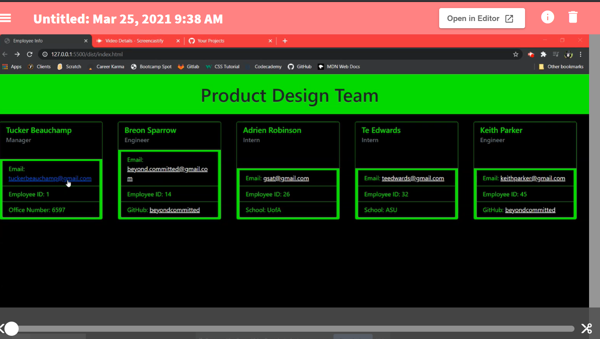
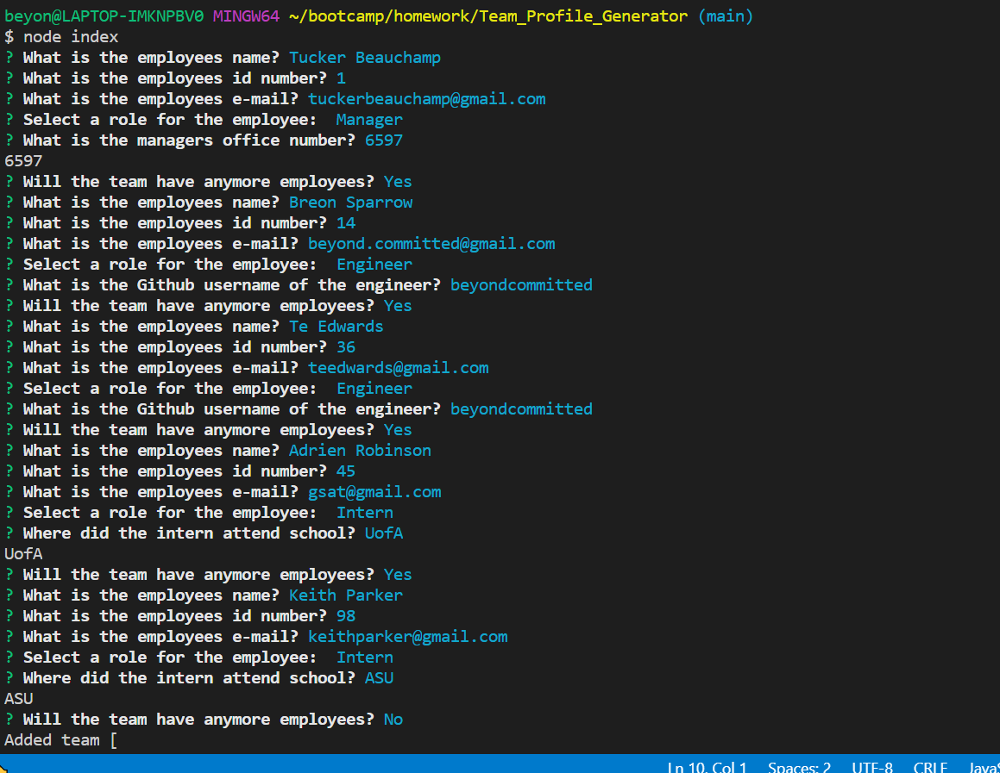
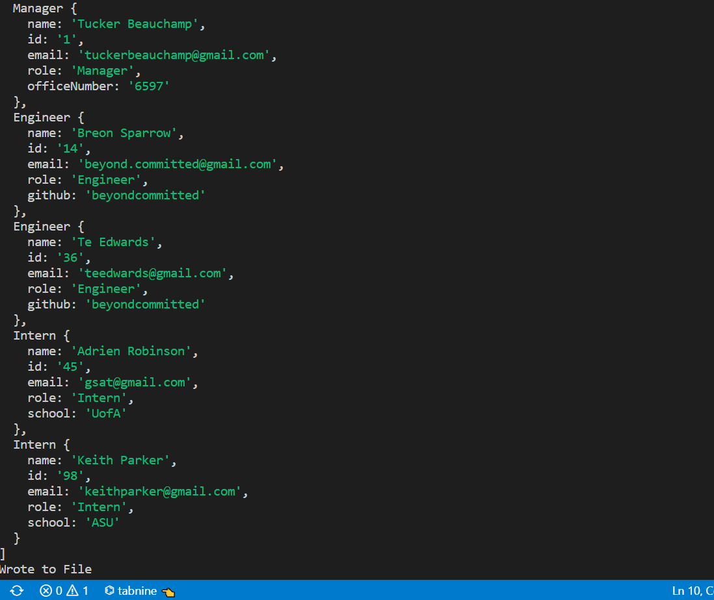
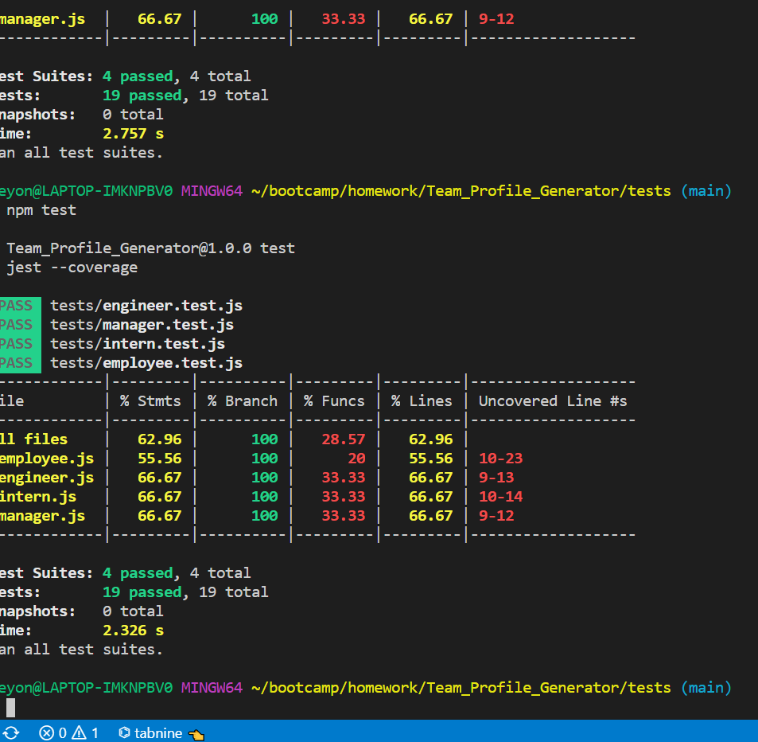

# Team_Profile_Generator

## Creator Story
```
Using the node.js envionment questions were created to generate a document for particular employee information. This will allow the user to organze a team of employee information in and efficient and effective manor.
```
---
## Links to Application and GitHub
Below are the needed links to the view this application and its functionality:<br>
https://github.com/beyondcommitted/Team_Profile_Generator<br>
https://beyondcommitted.github.io/Team_Profile_Generator/index.html<br>
https://youtu.be/eK73XUy3lxo
---
## User Story
```
AS A manager
I WANT to generate a webpage that displays my team's basic info
SO THAT I have quick access to their emails and GitHub profiles
```
---
## Met Acceptance Criteria
```
GIVEN a command-line application that accepts user input
WHEN user is prompted for the team members and their information
THEN an HTML file is generated that displays a nicely formatted team roster based on user input
WHEN user clicks on an email address in the HTML
THEN the default email program opens and populates the TO field of the email with the address
WHEN user clicks on the GitHub username
THEN that GitHub profile opens in a new tab
WHEN user starts the application
THEN user is prompted to enter the employee name, employee ID, email address, and choose a role
WHEN user presented a menu with the option to choose a role the corresponding office number, GitHub, or School question is prompted after
THEN user is able to add an engineer or an intern or to end adding employees
WHEN user selects the engineer option
THEN user is prompted to enter the engineer’s name, ID, email, and GitHub username, and then asked if continuing to add employees
WHEN user selects the intern option
THEN user is prompted to enter the intern’s name, ID, email, and school, and then asked if continuing to add employees
WHEN user decides to finish building my team
THEN user says no and exits the application, and the HTML is generated
```
---
## Mock Up




